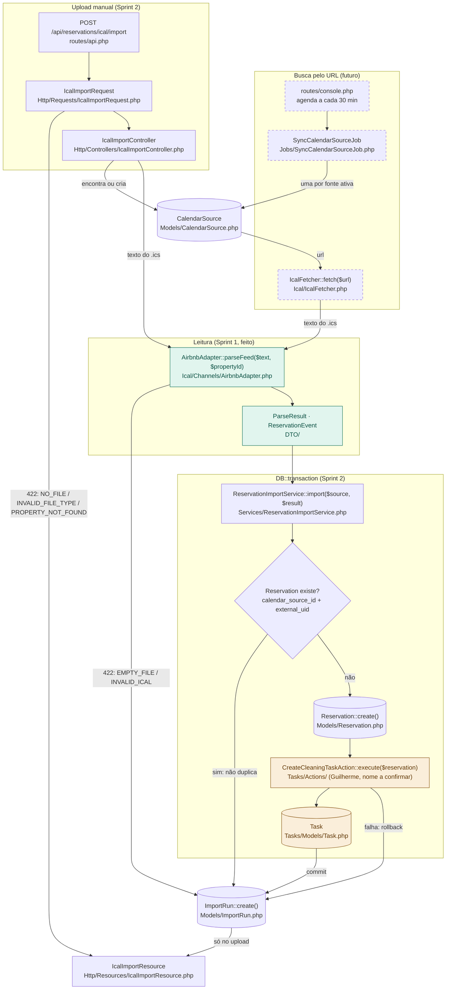

```mermaid
flowchart TD
    subgraph AUTO["Busca pelo URL (futuro)"]
        CONSOLE["routes/console.php<br/>agenda a cada 30 min"]
        JOB["SyncCalendarSourceJob<br/>Jobs/SyncCalendarSourceJob.php"]
        FETCHER["IcalFetcher::fetch($url)<br/>Ical/IcalFetcher.php"]
    end

    subgraph UPLOAD["Upload manual (Sprint 2)"]
        ROUTE["POST /api/reservations/ical/import<br/>routes/api.php"]
        REQUEST["IcalImportRequest<br/>Http/Requests/IcalImportRequest.php"]
        CONTROLLER["IcalImportController<br/>Http/Controllers/IcalImportController.php"]
    end

    SOURCE[("CalendarSource<br/>Models/CalendarSource.php")]

    subgraph READ["Leitura (Sprint 1, feito)"]
        ADAPTER["AirbnbAdapter::parseFeed($text, $propertyId)<br/>Ical/Channels/AirbnbAdapter.php"]
        DTO["ParseResult · ReservationEvent<br/>DTO/"]
    end

    subgraph TX["DB::transaction (Sprint 2)"]
        SERVICE["ReservationImportService::import($source, $result)<br/>Services/ReservationImportService.php"]
        EXISTS{"Reservation existe?<br/>calendar_source_id + external_uid"}
        RESERVATION[("Reservation::create()<br/>Models/Reservation.php")]
        ACTION["CreateCleaningTaskAction::execute($reservation)<br/>Tasks/Actions/ (Guilherme, nome a confirmar)"]
        TASK[("Task<br/>Tasks/Models/Task.php")]
    end

    IMPORTRUN[("ImportRun::create()<br/>Models/ImportRun.php")]
    RESOURCE["IcalImportResource<br/>Http/Resources/IcalImportResource.php"]

    CONSOLE --> JOB
    JOB -- "uma por fonte ativa" --> SOURCE
    SOURCE -- "url" --> FETCHER
    FETCHER -- "texto do .ics" --> ADAPTER

    ROUTE --> REQUEST
    REQUEST -- "422: NO_FILE / INVALID_FILE_TYPE / PROPERTY_NOT_FOUND" --> RESOURCE
    REQUEST --> CONTROLLER
    CONTROLLER -- "encontra ou cria" --> SOURCE
    CONTROLLER -- "texto do .ics" --> ADAPTER

    ADAPTER -- "422: EMPTY_FILE / INVALID_ICAL" --> IMPORTRUN
    ADAPTER --> DTO
    DTO --> SERVICE
    SERVICE --> EXISTS
    EXISTS -- "sim: não duplica" --> IMPORTRUN
    EXISTS -- "não" --> RESERVATION
    RESERVATION --> ACTION
    ACTION --> TASK
    TASK -- "commit" --> IMPORTRUN
    ACTION -- "falha: rollback" --> IMPORTRUN

    IMPORTRUN -- "só no upload" --> RESOURCE

    classDef future stroke-dasharray: 5 5
    classDef done fill:#E1F5EE,stroke:#0F6E56,color:#085041
    classDef tasks fill:#FAEEDA,stroke:#854F0B,color:#633806
    class CONSOLE,JOB,FETCHER future
    class ADAPTER,DTO done
    class ACTION,TASK tasks
```